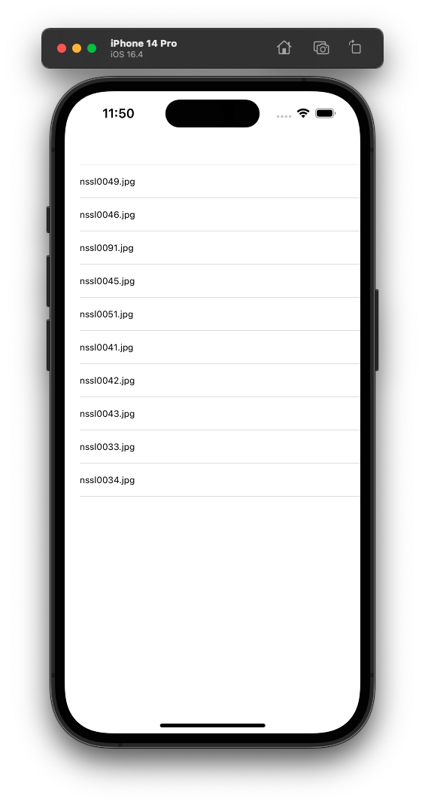
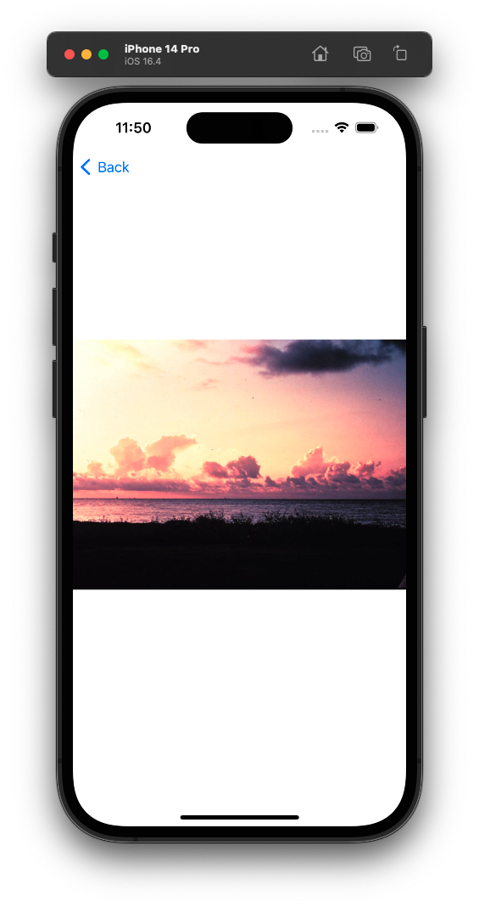
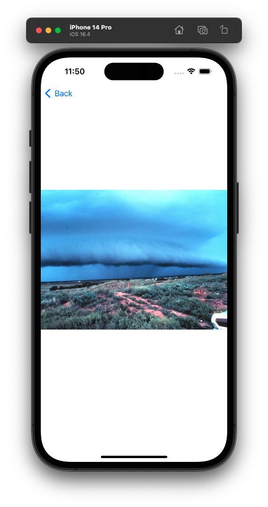

# Photo Viewer
Simple iOS application for viewing photo's stored in a table view (built for practicing iOS development fundamentals)

## Quick rundown:
The project stores some images in the main bundle's resources directory.  
The image file names are displayed in a simple **UITableView** column of cells. 
We use the **dequeueReusableCell** method for when new cells need to be displayed on the screen.  
Instead of creating a new cell for each item, which can be resource-intensive, the dequeueReusableCell method allows us to reuse existing cells that are no longer visible on the screen.

  
  
  

